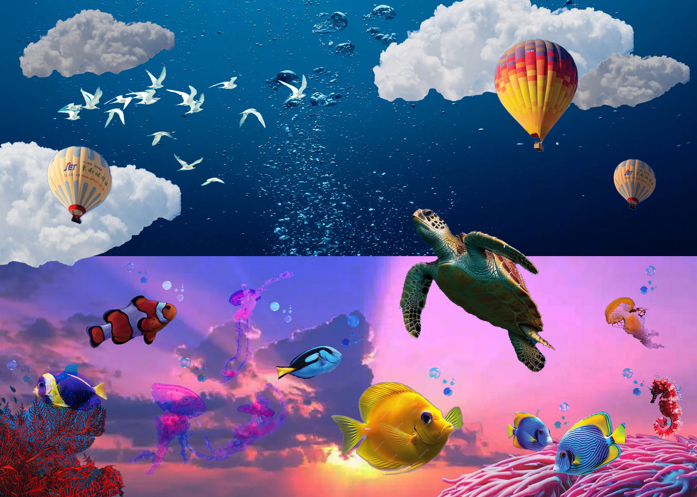
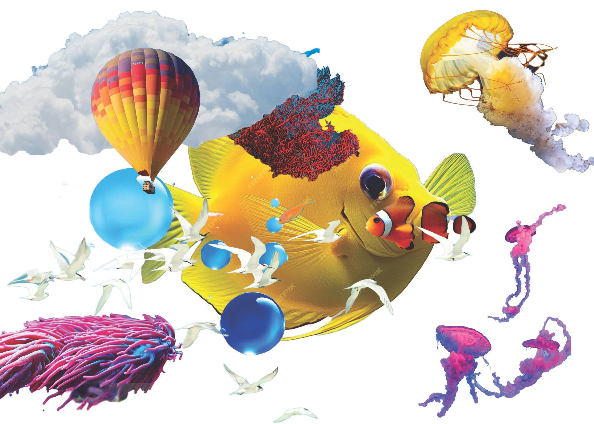
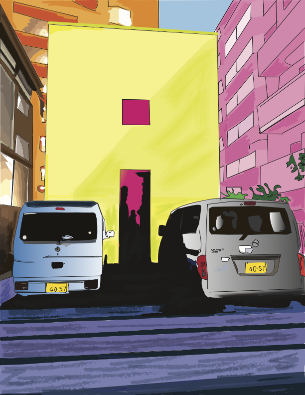
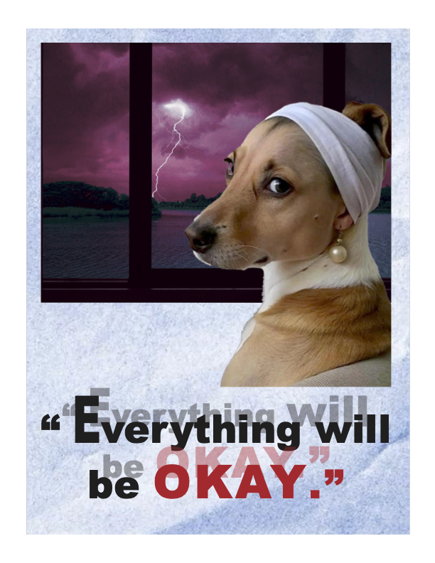
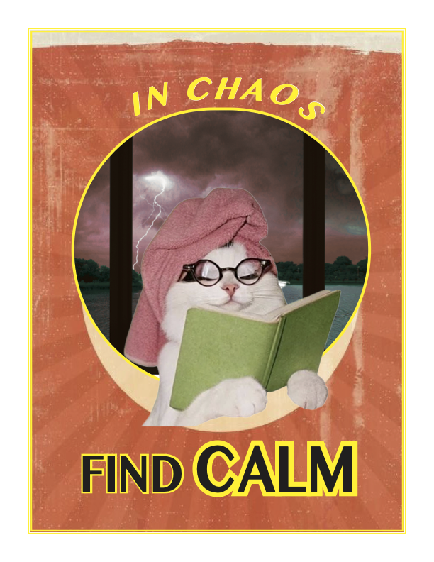
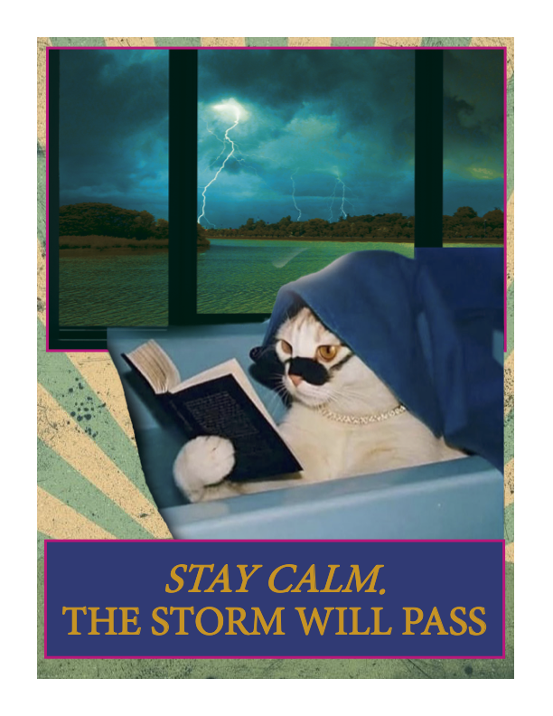

# Digital Art

This section includes digital work I made using Photoshop, Illustrator, and InDesign.  
I explored collage, composition, and typography through different projects.

---

##  Surreal Ocean Collage

  

  

I reversed the positions of the sky and ocean to create a surreal, continuous space where the boundary between the two becomes unclear.

The top image is the main composition, where ocean life appears to exist within the sky. For the second image, I reused the same elements and rearranged them into a different composition to explore how placement changes the overall perception.

---

##  Tokyo Street Illustration

  

I recreated this scene based on a photo I took in Tokyo. 
I focused on capturing the atmosphere while simplifying the shapes and colors.

---

##  Everything Will Be OK

  

  

  

I made this series of posters to explore calm and reassurance, using contrast between the background and the text to emphasize the message.

