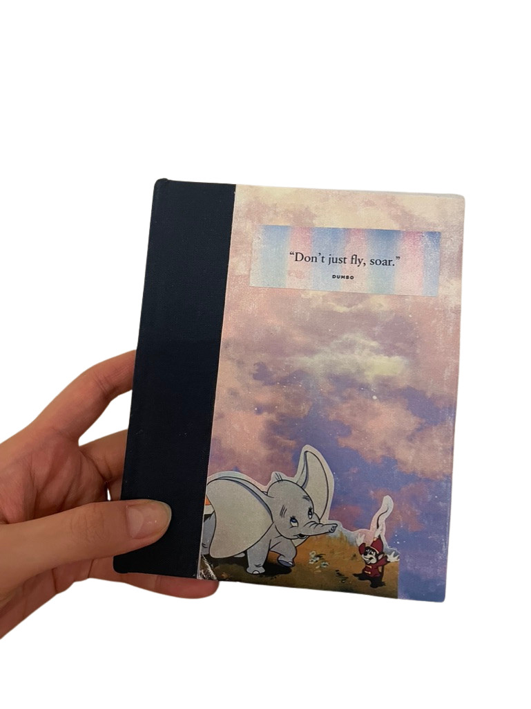
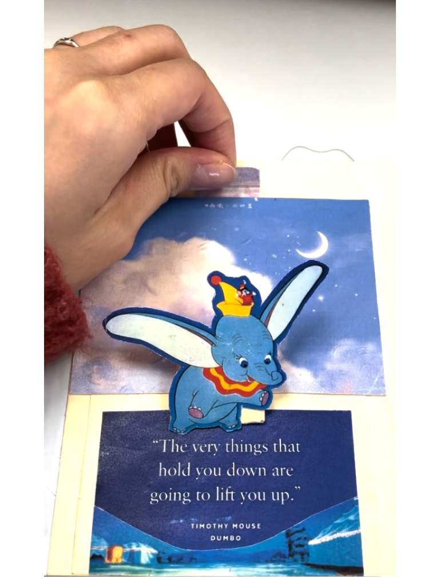
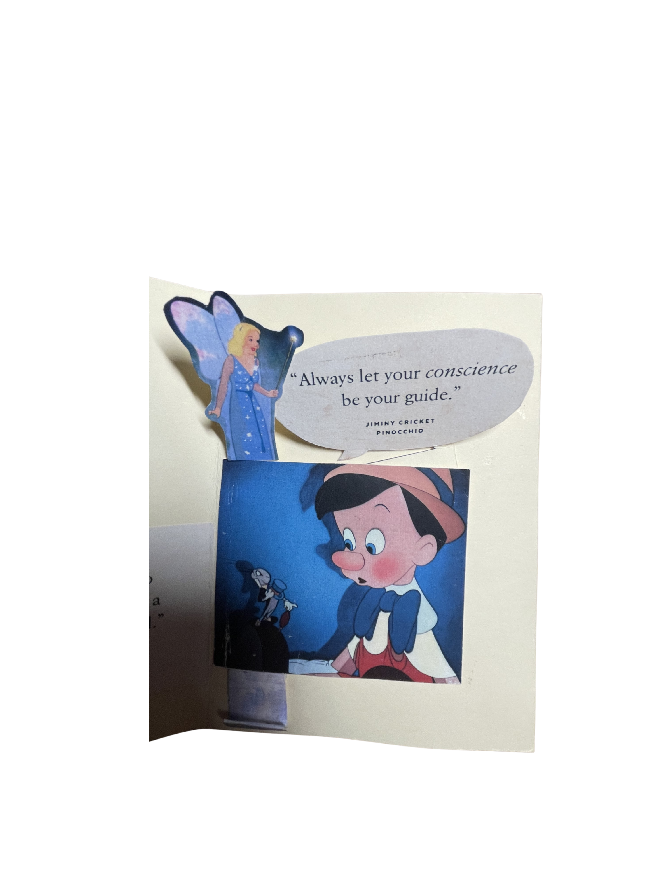
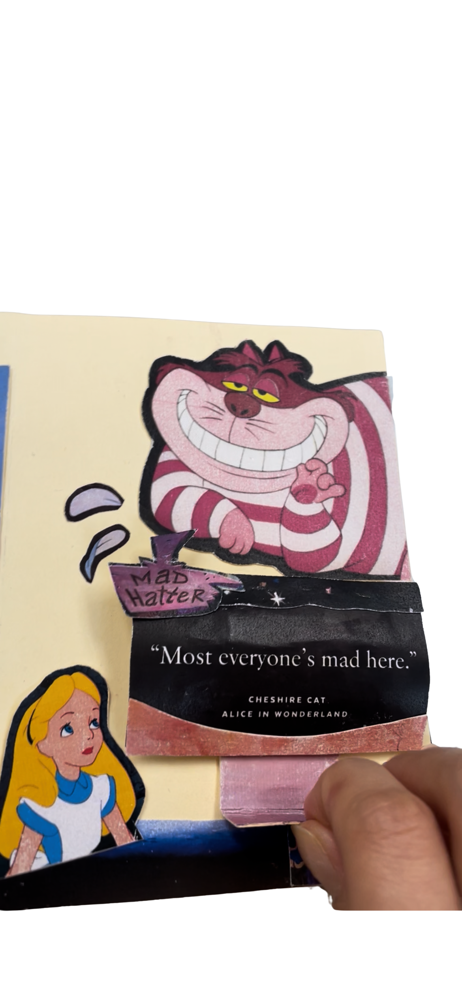

# Disney Pop-Up Book

This project started when I was thinking a lot about my direction and future. I picked quotes from Disney stories that felt personal to me and tried to turn them into something physical and interactive. Each page uses simple pop-up or sliding elements to reveal the message. Instead of focusing only on how it looks, I was more interested in how interaction could make the experience feel a bit more personal.

---

##  Cover

---

##  Dumbo

  

I used a lift mechanism so that Dumbo rises up, almost like he's flying.

---

##  Cinderella

I used a pull-tab so that Cinderella rises up when you move it.

---

##  Pinocchio

I added a simple back-and-forth movement to draw attention to the message.

---

##  Cheshire Cat

I added a small movement to make the message feel more playful and noticeable.

