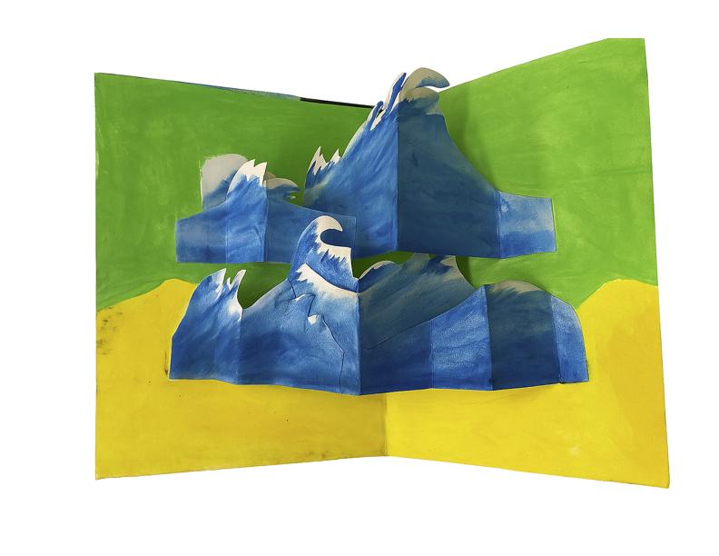
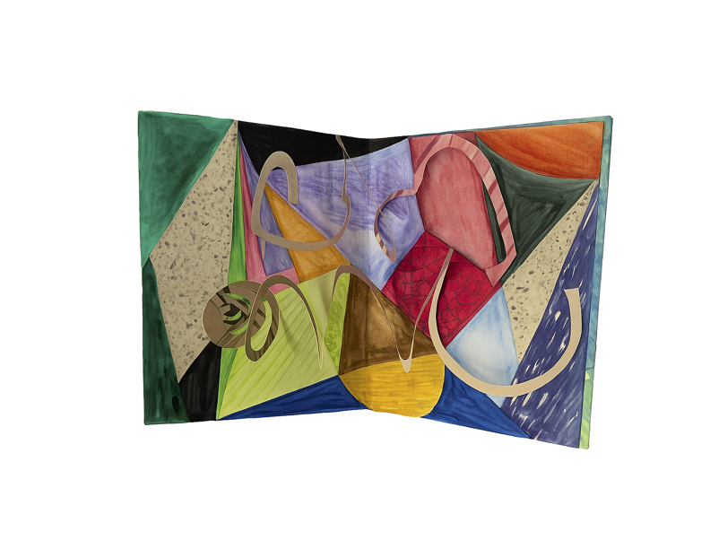
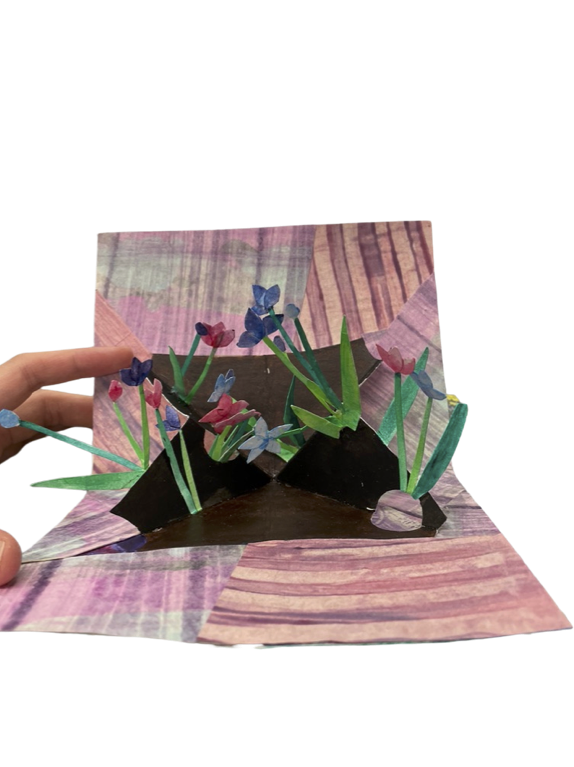
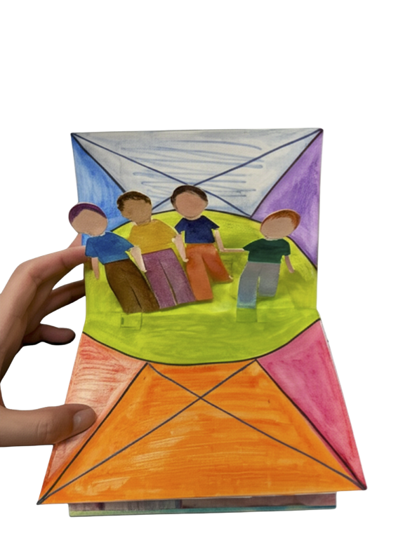

# Unfolded Worlds

This series explores how flat paper can transform into dimensional forms. I focused on how folding, layering, and structure can change the way we perceive and experience space.

Since this was part of a paper engineering class, I also paid close attention to how each piece folds and unfolds, thinking about the underlying structure and mechanisms behind the movement.

I spent time thinking about color combinations and patterns to make each piece feel bright and eye-catching, while still working well together as a whole.

---

##  Cover

---

##  Folded Waves

I used repeated shapes and layering to create a sense of movement, making the waves feel like they are flowing forward even though the structure is static.

---

##  Composed Chaos

I explored contrast by combining structured shapes with more organic lines, creating a composition that feels chaotic but still balanced.

---

##  Folded Garden

This was an attempt to recreate something natural using simple paper structures. 
I focused on how small elements could build up into a scene that feels alive.

---

##  Shared Space

This piece is more about people and how they exist together in the same space.  
I tried to keep it simple, but still show a sense of interaction.

---

